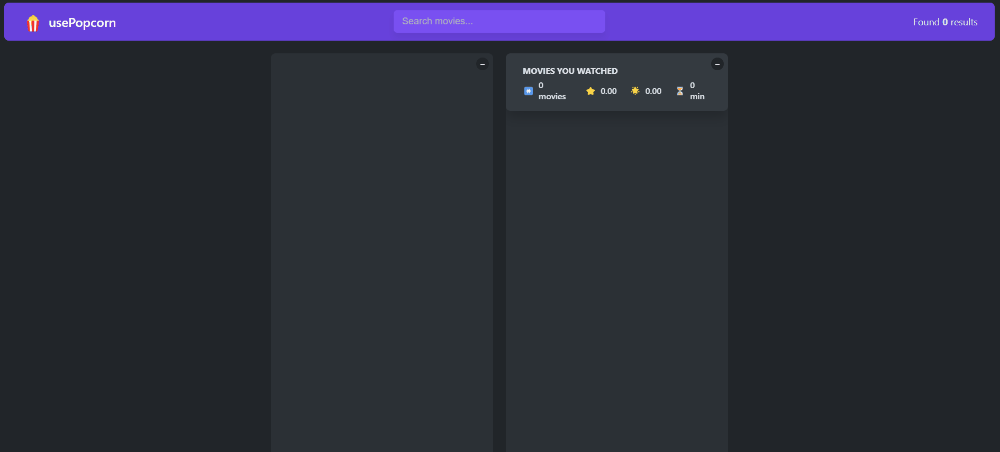

# usePopCorn

## Overview

A web app to **search for movies and shows**, **add them to a watchlist**, and **rate them**, powered by a public movie API.

Built with **React**, **CSS**, and persistent storage via **localStorage**.  
Fast, responsive, and user-friendly.

## Live Demo

This web app was deployed on vercel, it can be tried in here -> [usePopCorn](https://eat-n-split-psi-gold.vercel.app/)

## Preview



## Features

- **Search for movies** using a public API (OMDb)
- **Add movies to a watchlist**
- **Rate and remove movies**
- **Persistent data** using localStorage
- Fully **responsive design** (mobile & desktop)

## Technologies

- React
- CSS
- JavaScript
- LocalStorage API
- OMDb API

## Getting Started

To run this project locally:

1. Clone the repo:

   ```bash
   git clone https://github.com/davidccgithub/usepopcorn.git
   cd usepopcorn
   ```

2. Install dependencies:

   ```bash
   npm install
   ```

3. Start the server:
   ```bash
   npm start
   ```

The app will run on [http://localhost:3000](http://localhost:3000).

## Disclaimer

This project was built for educational purposes only.
